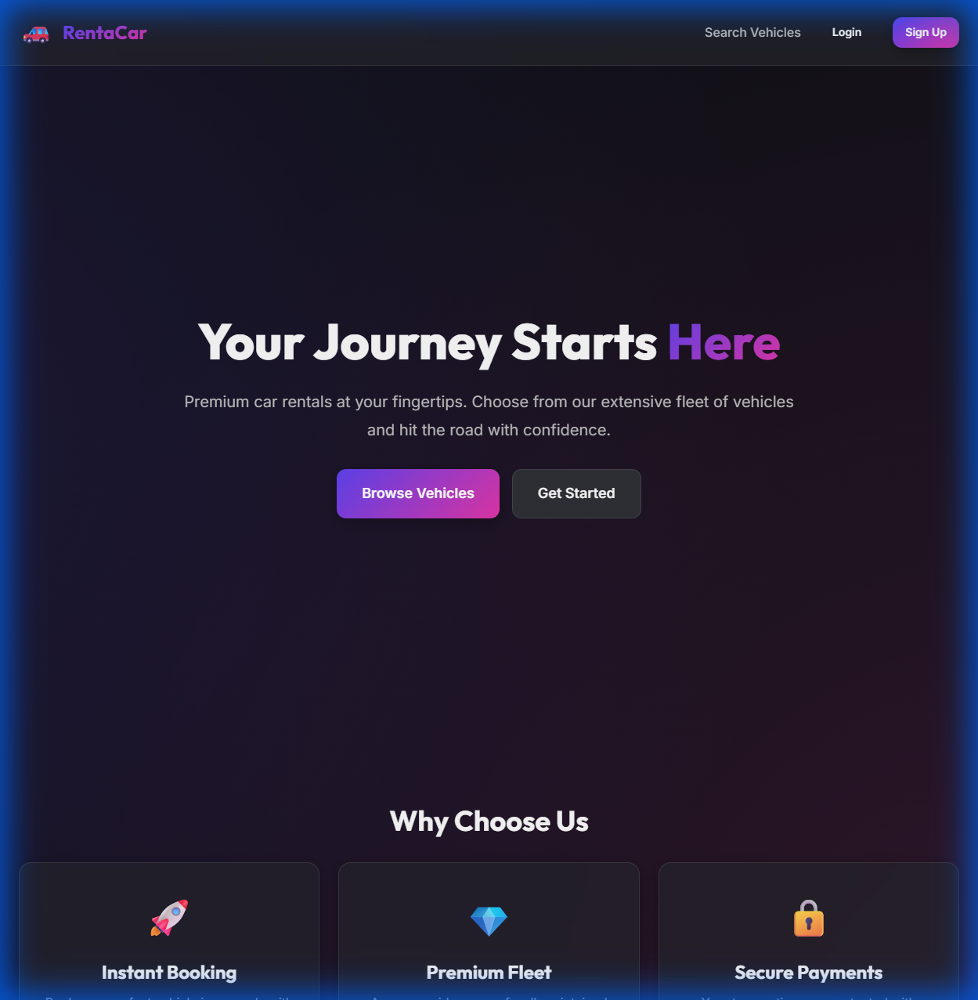
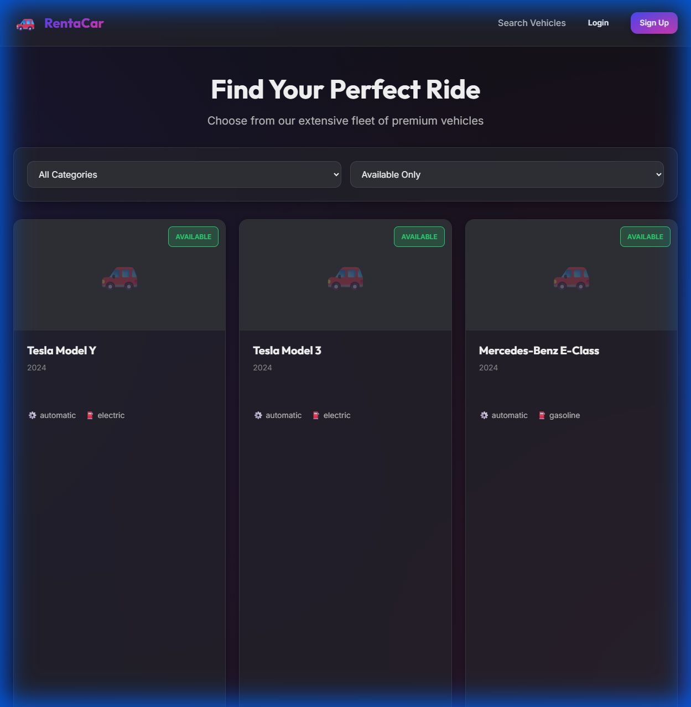
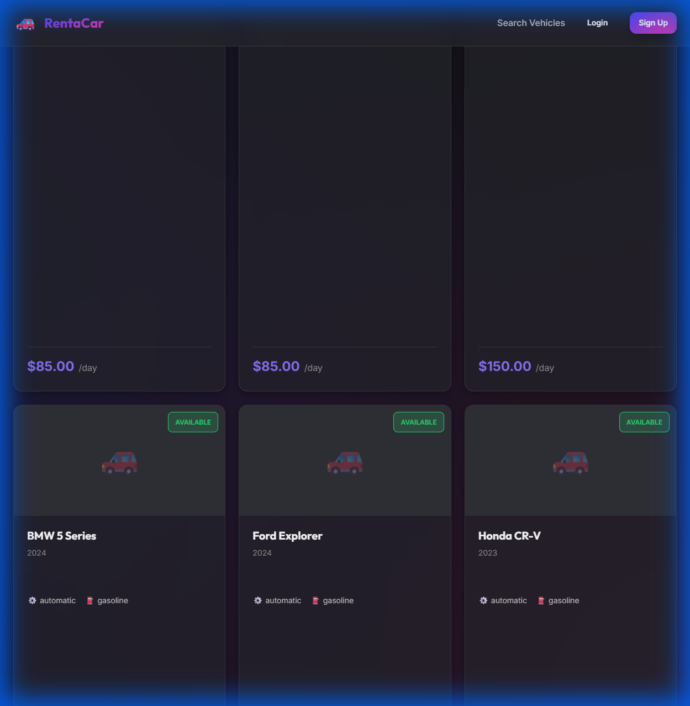
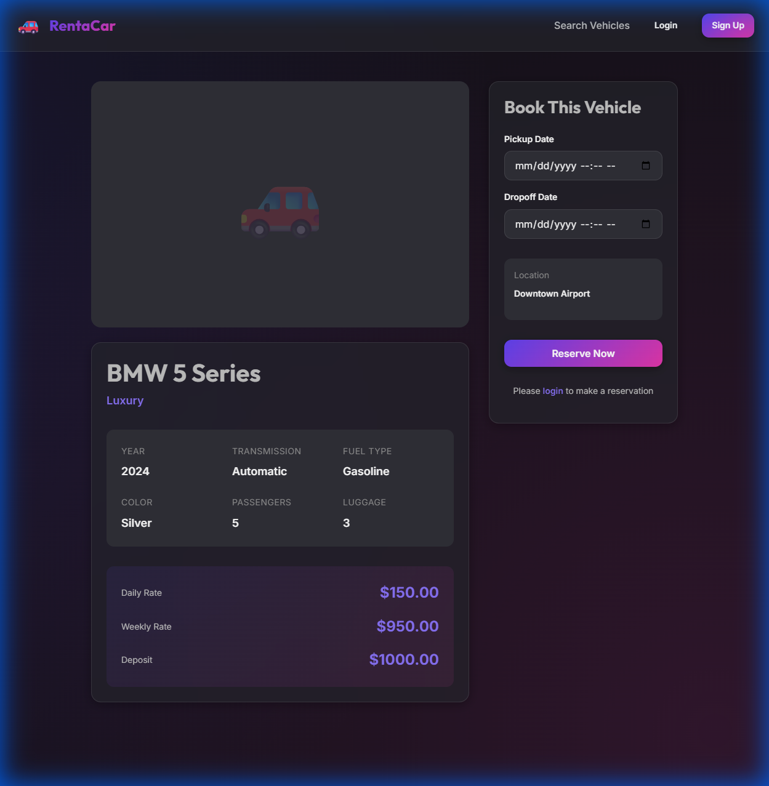
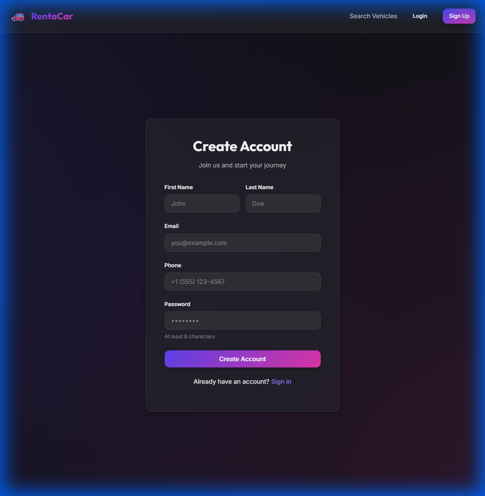
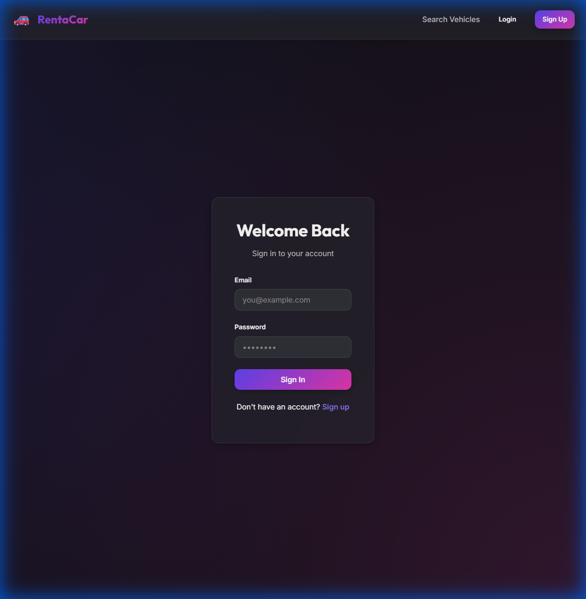
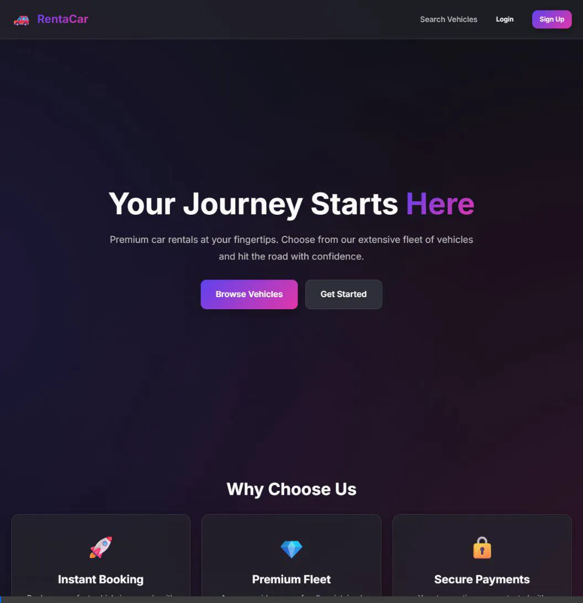

# Rental Car System - Demo Presentation

## 🚀 System Overview

A production-ready rental car management system built with modern microservices architecture.

### Technology Stack
- **Frontend**: React 18 + Vite
- **Backend**: Node.js + Express (5 Microservices)
- **Database**: PostgreSQL 15
- **Cache**: Redis 7
- **Payments**: Stripe API
- **Infrastructure**: Docker + Docker Compose

---

## 📊 Architecture

### Microservices
1. **Auth Service** (Port 3001) - JWT Authentication
2. **Fleet Service** (Port 3004) - Vehicle Management
3. **Reservation Service** (Port 3002) - Booking Logic
4. **Payment Service** (Port 3003) - Stripe Integration
5. **Reporting Service** (Port 3005) - Analytics

### API Gateway (Port 3000)
- Unified API facade
- Request routing
- Authentication middleware
- Rate limiting

---

## 🎨 User Interface Showcase

### Homepage



**Features:**
- Modern dark theme with vibrant gradients
- Glassmorphism effects
- Hero section with call-to-action
- Feature cards highlighting benefits
- Smooth animations and transitions

---

### Vehicle Search & Catalog



**Sample Data Loaded:**
- **13 Vehicles** across 5 categories
- **3 Locations** in State College, PA
- Real-time availability status
- Category and location filtering



**Vehicle Categories:**
- **Economy** - $45/day (Toyota Corolla, Honda Civic, Hyundai Elantra)
- **Sedan** - $65/day (Honda Accord, Toyota Camry, Nissan Altima)
- **SUV** - $95/day (Toyota RAV4, Honda CR-V, Ford Explorer)
- **Luxury** - $150/day (BMW 5 Series, Mercedes-Benz E-Class)
- **Electric** - $85/day (Tesla Model 3, Tesla Model Y)

---

### Vehicle Details



**Detailed Information:**
- Complete vehicle specifications
- Pricing (daily, weekly, monthly rates)
- Passenger and luggage capacity
- Transmission and fuel type
- Real-time availability checking
- Booking form with date selection
- Deposit information

---

### User Registration



**Registration Features:**
- Multi-field form validation
- Password strength requirements
- Phone number formatting
- Responsive design
- Error handling

---

### User Login



**Authentication:**
- JWT-based authentication
- Secure password handling
- Remember me functionality
- Error messaging
- Redirect to dashboard after login

---

## 🎬 Complete System Demo



**Demo Flow:**
1. Homepage navigation
2. Vehicle search and filtering
3. Vehicle details viewing
4. User registration process
5. Login authentication
6. Dashboard access

---

## 📝 Test Credentials

### Admin Account
- **Email**: admin@rentalcar.com
- **Password**: admin123
- **Access**: Full system administration

### Customer Accounts
- **Email**: john.doe@email.com | **Password**: customer123
- **Email**: jane.smith@email.com | **Password**: customer123
- **Email**: mike.johnson@email.com | **Password**: customer123

---

## ✨ Key Features

### Customer Features
✅ Vehicle search with real-time filtering  
✅ Detailed vehicle information  
✅ Instant booking with date selection  
✅ Secure payment processing (Stripe)  
✅ Reservation management  
✅ User dashboard  

### Admin Features
✅ Fleet management (CRUD operations)  
✅ Reservation overview  
✅ Revenue analytics  
✅ User management  
✅ Dashboard with statistics  

### Technical Features
✅ Microservices architecture  
✅ JWT authentication  
✅ Role-based access control  
✅ Redis caching for performance  
✅ PostgreSQL database  
✅ Docker containerization  
✅ Responsive design  
✅ RESTful API  

---

## 🗄️ Sample Data Summary

### Locations (3)
- Downtown Airport - 123 Airport Blvd
- University Campus - 456 College Ave
- North Hills Mall - 789 Mall Drive

### Vehicles (13)
- 3 Economy cars
- 3 Sedans
- 3 SUVs
- 2 Luxury vehicles
- 2 Electric vehicles

### Users (4)
- 1 Admin
- 3 Customers

---

## 🚀 Running the System

### Start Services
```bash
# Start databases
docker-compose up -d

# Start backend (in backend directory)
npm run dev

# Start frontend (in frontend/web directory)
npm run dev
```

### Access Points
- **Frontend**: http://localhost:5173
- **API Gateway**: http://localhost:3000
- **Database**: localhost:5432
- **Redis**: localhost:6379

---

## 📊 Design Patterns Implemented

1. **Singleton** - Database connection pooling
2. **Factory Method** - Service creation in API gateway
3. **Observer** - Event-driven reservation updates
4. **Strategy** - Payment processing (extensible)
5. **Facade** - API Gateway for microservices

---

## 🎯 Next Steps

### For Testing
1. Test complete booking flow
2. Verify payment integration
3. Test admin dashboard
4. Load testing with multiple users

### For Production
1. Configure production environment variables
2. Set up real Stripe account
3. Deploy to cloud (AWS/GCP/Azure)
4. Configure CI/CD pipeline
5. Set up monitoring and logging

---

## 📞 Support

**System Status**: ✅ Fully Operational  
**All Services**: Running  
**Sample Data**: Loaded  
**Ready for**: Demo & Testing  

---

**Built with ❤️ using modern web technologies**

*Penn State Rental Car System Project*
